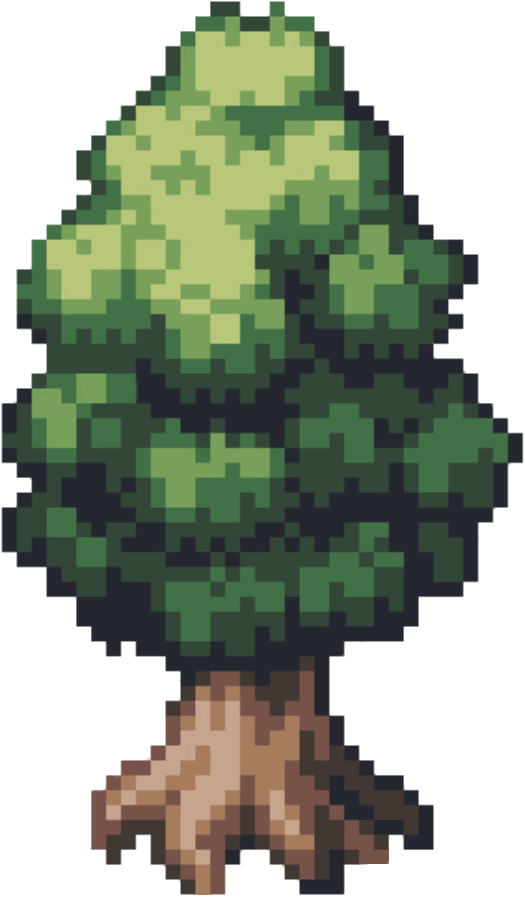
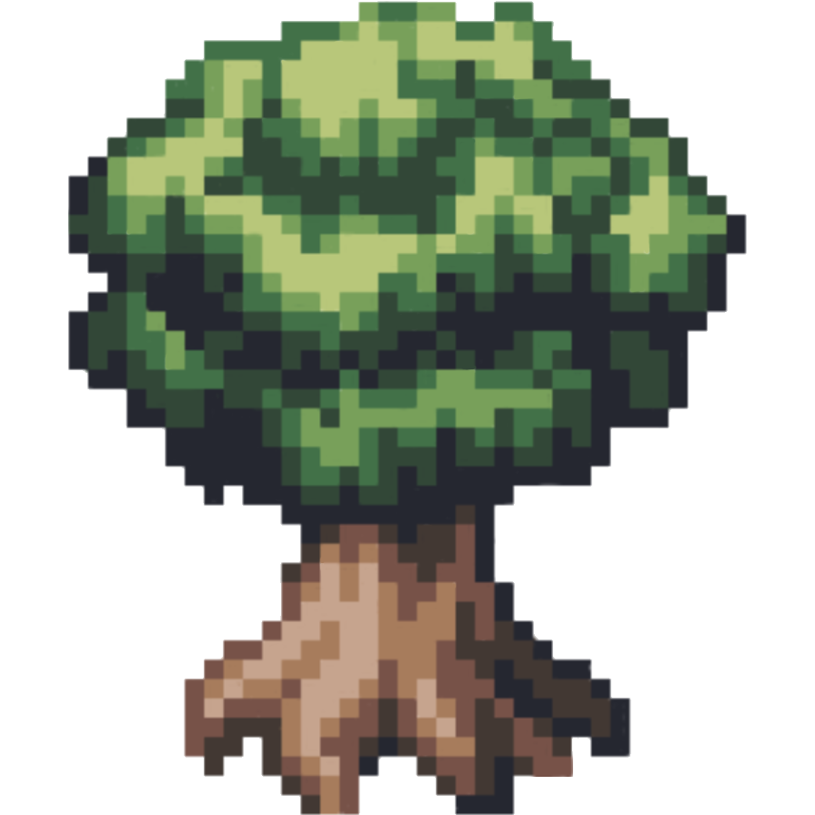

# Map
I'm as free as a bird, yet I can't fly. So, the best I can do, is climb in a tree.

This is my map, of all the tree I found which are climable. I hold it very dear because there aren't many trees which are climable, and this helps me keep track of what is where.

<iframe src="https://www.google.com/maps/d/embed?mid=1rexbN4E9FwTg3A7drjZBdTnQAMmkUco&ehbc=2E312F" width="640" height="480"></iframe>

## Legend

|Icon|Meaning|
|-|-|
||Large tree (≥6m)|
||Medium tree (4-5m) or tree with undefined width|
||Small tree (≤3m)|
||Medium / large object (≥4m)|
|||
|||
|||
|||
|||
